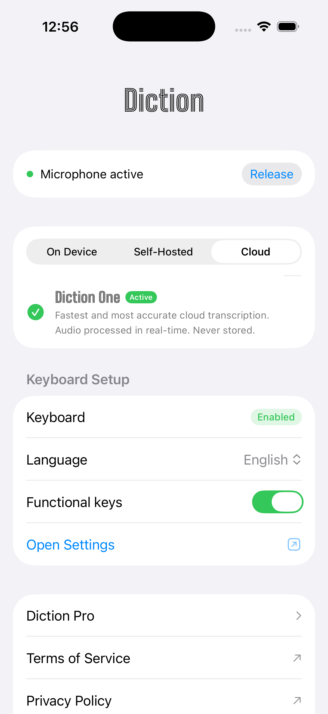
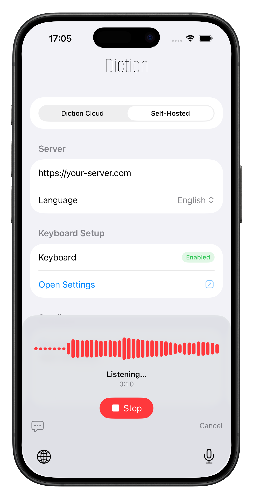

<p align="center">
  <picture>
    <source media="(prefers-color-scheme: dark)" srcset="assets/logo-light.png">
    <source media="(prefers-color-scheme: light)" srcset="assets/logo-dark.png">
    
  </picture>
  <br><br>
  <strong>Speech-to-text keyboard for iOS.</strong><br>On-device, self-hosted, or cloud. Your choice.
</p>

<p align="center">
  <!-- <a href="https://apps.apple.com/app/diction/id000000000"></a> -->
  <a href="https://diction.one">Website</a> &bull;
  <a href="docs/privacy.md">Privacy Policy</a> &bull;
  <a href="https://github.com/omachala/diction/issues">Report a Bug</a>
</p>

<p align="center">
  
  <!--  -->
</p>

---

<p align="center">
  &nbsp;&nbsp;
  
</p>

## What is Diction

An iOS keyboard for speech-to-text. Switch to it in any app, tap the mic, speak, and the text is inserted. No QWERTY — dictation only.

Three ways to transcribe:

- **On-Device** — runs directly on your iPhone. No network, no server, completely offline. Free.
- **Self-Hosted** — run your own transcription server. Audio stays on your network. Free, forever.
- **Cloud** — zero setup, fast transcription via Diction's hosted API. Free trial, then $3.99/mo.

The app is pure Swift with zero third-party SDKs — no analytics, no tracking, no telemetry. The self-hosting infrastructure (a Go gateway and Docker Compose setup) is open source and lives in this repo.

## Getting Started

### 1. Install the keyboard

1. Download Diction from the App Store
2. **Settings → General → Keyboard → Keyboards → Add New Keyboard → Diction**
3. Enable **Allow Full Access** (required by iOS for network access — [why?](docs/privacy.md#keyboard-extension--full-access))

### 2. Pick a mode

**On-Device** — open the app, select On-Device mode, download a model, done. Works offline, audio never leaves your phone.

**Cloud** — select Cloud mode, pick a model. Works immediately. Free trial included.

**Self-Hosted** — run a transcription server on your own machine:

```bash
git clone https://github.com/omachala/diction.git
cd diction
docker compose up -d gateway whisper-small
```

Then in the app: **Settings → Self-Hosted** → set the endpoint to `http://<your-server-ip>:9000`.

### 3. Dictate

Open any app, tap 🌐 to switch to Diction, tap the mic, speak. Text appears.

## Models

Diction is model-agnostic. The app, the gateway, and the Docker setup all let you choose which model to run. Different models have different trade-offs between speed, accuracy, size, and language support.

### On-device models

Downloaded and run directly on your iPhone. No network needed.

| Model | Size | Best for |
|-------|------|----------|
| Whisper Tiny | ~75 MB | Fastest, any iPhone |
| **Whisper Base** | **~142 MB** | **Recommended — good balance of speed and accuracy** |
| Whisper Small | ~466 MB | Better accuracy, newer iPhones |
| Whisper Large Turbo | ~1.6 GB | Best on-device accuracy, latest iPhones |

### Server models (self-hosted & cloud)

Run on your server or via Diction Cloud. Faster and more accurate than on-device.

| Service | Model | Port | RAM | Latency (CPU) | Best for |
|---------|-------|------|-----|---------------|----------|
| `whisper-tiny` | Whisper Tiny | 9001 | ~350 MB | ~1-2s | Low-power devices |
| **`whisper-small`** | **Whisper Small** | **9002** | **~800 MB** | **~3-4s** | **Best starting point** |
| `whisper-medium` | Whisper Medium | 9003 | ~1.8 GB | ~8-12s | Accents, background noise |
| `whisper-large` | Whisper Large V3 | 9004 | ~3.5 GB | ~20-30s | Maximum Whisper accuracy |
| `whisper-distil-large` | Distil Whisper Large V3 | 9005 | ~2 GB | ~4-6s | Near-best quality, English only |
| `parakeet` | NVIDIA Parakeet TDT 0.6B | 9006 | ~2 GB | ~1-2s | Best speed + accuracy, 25 European languages |

Start any combination:

```bash
docker compose up -d gateway whisper-small
docker compose up -d gateway whisper-small parakeet
docker compose up -d gateway whisper-small whisper-medium
```

Models download on first start and are cached — subsequent starts are instant.

You can also point Diction at anything else: [whisper.cpp](https://github.com/ggerganov/whisper.cpp), [OpenAI's API](https://platform.openai.com/docs/api-reference/audio), a fine-tuned model, or any future model. If it has a `/v1/audio/transcriptions` endpoint, Diction works with it.

## Gateway

The gateway is a lightweight Go service (~15 MB Docker image) that sits in front of your model backends:

- **Model routing** — one URL, multiple models. Switch from the app without reconfiguring your server.
- **WebSocket streaming** — audio streams to the server during recording. Transcription starts the moment you stop — no upload wait.
- **Format conversion** — automatically converts audio to the format each backend needs.
- **Health monitoring** — checks each backend every 30s. `GET /v1/models` shows which are online.

The gateway is optional. You can point the app directly at a model backend. But if you run multiple models, the gateway lets you switch between them from the app.

### API

[OpenAI-compatible](https://platform.openai.com/docs/api-reference/audio/createTranscription) transcription API:

```bash
# Health check
curl http://localhost:9000/health

# List available models with health status
curl http://localhost:9000/v1/models

# Transcribe audio
curl -X POST http://localhost:9000/v1/audio/transcriptions \
  -F file=@recording.wav \
  -F model=small
```

WebSocket streaming:

```
WS /v1/audio/stream?model=small&language=en

1. Client sends binary frames: raw PCM audio (16-bit LE, mono, 16kHz)
2. Client sends text frame: {"action":"done"}
3. Server replies: {"text":"transcribed text"}
```

### Configuration

| Variable | Default | Description |
|----------|---------|-------------|
| `GATEWAY_PORT` | `8080` | Port the gateway listens on (mapped to 9000 in Docker Compose) |
| `DEFAULT_MODEL` | `small` | Model used when no `model` field is specified |
| `MAX_BODY_SIZE` | `10485760` | Max upload size in bytes (10 MB) |

## Remote Access

Your phone needs to reach the server. On the same Wi-Fi, use the local IP directly. For access from anywhere:

**[Cloudflare Tunnel](https://developers.cloudflare.com/cloudflare-one/connections/connect-networks/)** (recommended) — free, outbound-only. No port forwarding, no public IP needed.

```bash
cloudflared tunnel create diction
cloudflared tunnel route dns diction whisper.yourdomain.com
cloudflared tunnel run --url http://localhost:9000 diction
```

**[Tailscale](https://tailscale.com/)** — free WireGuard mesh VPN. Install on server + iPhone, get a stable `100.x.y.z` IP.

**Reverse proxy** — put the gateway behind [Caddy](https://caddyserver.com) for HTTPS:

```
whisper.yourdomain.com {
    reverse_proxy localhost:9000
}
```

WebSocket streaming works through Caddy out of the box.

**Other options:** [ngrok](https://ngrok.com/) (instant public URL), WireGuard (self-managed VPN), port forwarding with DDNS.

## GPU Support

For faster inference, use the CUDA variant of the Whisper image:

```yaml
whisper-small:
  image: fedirz/faster-whisper-server:latest-cuda
  deploy:
    resources:
      reservations:
        devices:
          - driver: nvidia
            count: 1
            capabilities: [gpu]
```

Requires an NVIDIA GPU and the [NVIDIA Container Toolkit](https://docs.nvidia.com/datacenter/cloud-native/container-toolkit/install-guide.html).

## How is Diction different?

<table width="100%">
<tr><th></th><th>Diction</th><th>Wispr Flow</th><th>Apple Dictation</th></tr>
<tr><td><strong>Price</strong></td><td>Free (on-device & self-hosted)<br>$3.99/mo (cloud)</td><td>$15/month</td><td>Free</td></tr>
<tr><td><strong>On-device transcription</strong></td><td>✅</td><td>❌</td><td>✅</td></tr>
<tr><td><strong>Self-hosted option</strong></td><td>✅</td><td>❌</td><td>❌</td></tr>
<tr><td><strong>Choose your model</strong></td><td>✅</td><td>❌</td><td>❌</td></tr>
<tr><td><strong>Open source</strong></td><td>✅ Gateway + server</td><td>❌</td><td>❌</td></tr>
<tr><td><strong>WebSocket streaming</strong></td><td>✅</td><td>❌</td><td>N/A</td></tr>
<tr><td><strong>Third-party SDKs in app</strong></td><td>None</td><td>Unknown</td><td>N/A</td></tr>
</table>

Diction is pure transcription — what you say is what you get. No AI rewriting, no "smart" corrections.

## Privacy

This is a keyboard extension. We take it seriously:

- **On-device**: Audio never leaves your phone.
- **Self-hosted**: Audio goes only to your server. Full stop.
- **Cloud**: Audio is processed and immediately discarded. Not stored, not used for training.
- **No analytics, no tracking, no telemetry.** Zero third-party SDKs in the app.
- **Full Access** is required by iOS for network access — the keyboard needs to reach the transcription endpoint. There is no QWERTY keyboard to log, no clipboard access.

Read the full [Privacy Policy](docs/privacy.md).

## Troubleshooting

### App

**Diction keyboard doesn't appear** — Settings → General → Keyboard → Keyboards → Add New Keyboard → Diction. Make sure **Allow Full Access** is enabled.

**No transcription / timeout** — check that your endpoint URL is correct and reachable from your phone. In Self-Hosted mode, your phone must be on the same network as your server (or use [remote access](#remote-access)).

**Transcription is slow** — try a smaller model or enable **Stream Audio** in settings. Streaming uploads audio during recording so transcription starts the moment you stop.

### Self-hosting

**Model takes a long time on first start** — normal. Weights download on first launch (~500 MB for Small, ~3 GB for Large V3). Cached in a Docker volume — subsequent starts are instant.

**Health check failing** — models need 1-2 minutes to load. Check logs: `docker compose logs -f whisper-small`

**Out of memory** — run fewer models or pick a smaller one. One model is all you need.

**Updating:**

```bash
docker compose pull
docker compose up -d
```

### Report a bug

[Open an issue](https://github.com/omachala/diction/issues/new?template=bug_report.md) with:
- Which mode you're using (On-Device, Self-Hosted, or Cloud)
- Your model and language settings
- Steps to reproduce
- For self-hosting: Docker version, OS, and logs (`docker compose logs`)

## Requirements

- **iOS 16.0+** (iPhone)
- For self-hosting: any machine that can run Docker (the gateway uses ~15 MB RAM)

## Contributing

Contributions to the gateway, Docker setup, and documentation are welcome. See [CONTRIBUTING.md](CONTRIBUTING.md).

## License

MIT — see [LICENSE](LICENSE).
