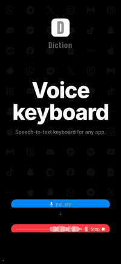

<p align="center">
  <picture>
    <source media="(prefers-color-scheme: dark)" srcset="assets/logo-light.png">
    <source media="(prefers-color-scheme: light)" srcset="assets/logo-dark.png">
    
  </picture>
  <br><br>
  <strong>You talk. We type.</strong>
  <br><br>
  Free speech-to-text keyboard for iOS.<br>Open-source self-hosted, on-device or cloud transcription.
</p>

<p align="center">
  <a href="https://apps.apple.com/app/diction-voice-keyboard/id6759807364"></a>
</p>

<p align="center">
  <a href="https://diction.one">Website</a> &bull;
  <a href="docs/self-hosting.md">Self-Hosting Guide</a> &bull;
  <a href="docs/privacy.md">Privacy Policy</a>
</p>

<p align="center">
  <a href="https://github.com/omachala/diction/blob/master/LICENSE"></a>
  <a href="https://codecov.io/gh/omachala/diction"></a>
</p>

---

<p align="center">
  &nbsp;
  &nbsp;
  &nbsp;
  
</p>

## Why Diction?

- **Dictation keyboard for any app** - a free Wispr Flow alternative. Switch to Diction in any text field, tap mic, speak. Text appears instantly.
- **What you say stays with you** - on-device mode works offline. Self-hosted sends audio only to your server. No third-party routing.
- **Free. No word limits. No catch.** - no trial, no cap, no subscription.
- **Self-host in three commands** - `git clone`, `docker compose up`, done. Server setup, gateway, and docs are all in this repo.
- **Any model, any server** - fine-tuned for your language. Licensed for your industry. Trained on your domain. You choose what runs.
- **99 languages** - multilingual transcription out of the box.

## How It Works

### On-Device (Free, No Setup)

Install the app, add the keyboard, and start dictating. On-device transcription works offline with no server required.

### Self-Hosted

Save this as `docker-compose.yml` and run `docker compose up -d`:

```yaml
services:
  gateway:
    image: ghcr.io/omachala/diction-gateway:latest
    ports:
      - "8080:8080"

  whisper-small:
    image: fedirz/faster-whisper-server:latest-cpu
    environment:
      WHISPER__MODEL: Systran/faster-whisper-small
      WHISPER__INFERENCE_DEVICE: cpu
```

Your server needs to be reachable from your phone. See [No Public IP?](#no-public-ip) for options like Cloudflare Tunnel, Tailscale, or ngrok.

Once reachable, open the Diction app, go to **Self-Hosted**, paste your server URL. Done.

#### More models

Swap or add models to your compose file. The gateway handles routing and streaming between them.

| Model | RAM | Latency (CPU) |
|-------|-----|---------------|
| `whisper-tiny` | ~350 MB | ~1-2s |
| `whisper-small` | ~800 MB | ~3-4s |
| `whisper-medium` | ~1.8 GB | ~8-12s |
| `whisper-large` | ~3.5 GB | ~20-30s |
| `whisper-distil-large` | ~2 GB | ~4-6s |
| `parakeet` | ~2 GB | ~1-2s |

See [`docker-compose.yml`](docker-compose.yml) in this repo for the full setup with all models.

#### Bring your own model

Run a model fine-tuned for your language, licensed for your industry, or trained on your domain. Point Diction at it and it just works.

## No Public IP?

No problem. You don't need to open ports on your router:

- **[Cloudflare Tunnel](https://developers.cloudflare.com/cloudflare-one/connections/connect-networks/)** - free, outbound-only connection. No port forwarding needed.
- **[Tailscale](https://tailscale.com/)** - free WireGuard mesh VPN. Install on server + phone, connect from anywhere.
- **[ngrok](https://ngrok.com/)** - instant public URL, great for testing.

See the [Self-Hosting Guide](docs/self-hosting.md) for detailed instructions.

## Privacy

This is a keyboard extension. We take privacy seriously:

- **On-device**: Everything stays on your phone. No network needed.
- **Self-hosted**: Audio goes only to your server. Full stop.
- **Diction One**: Audio is processed and immediately discarded. Not stored, not used for training.
- **No analytics, no tracking, no telemetry.** The app contains zero third-party SDKs.
- **Full Access** is required by iOS for network - the keyboard needs to reach the transcription endpoint. No keylogging, no clipboard access.

Read the full [Privacy Policy](https://diction.one/privacy).

## Requirements

- **iOS 17.0+** (iPhone)
- For self-hosting: any machine that can run Docker

## Contributing

All contributions are welcome! See [CONTRIBUTING.md](CONTRIBUTING.md).

## License

MIT. See [LICENSE](LICENSE).

The iOS app is distributed via the App Store. This repository contains the self-hosting infrastructure and documentation.
