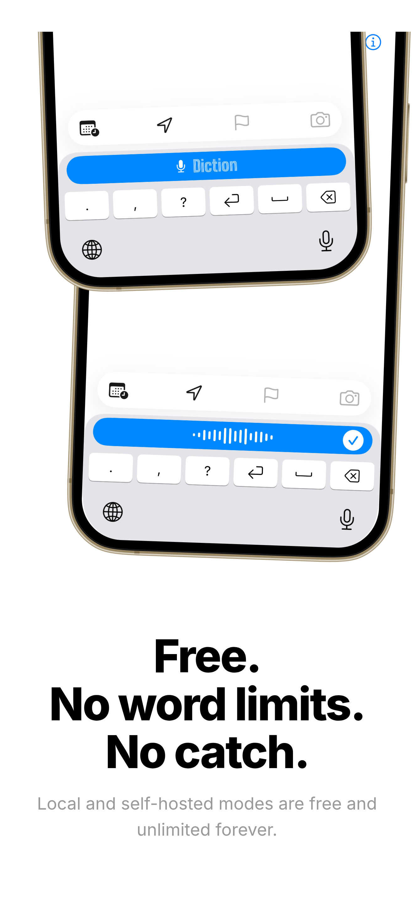
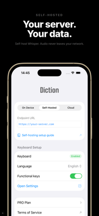
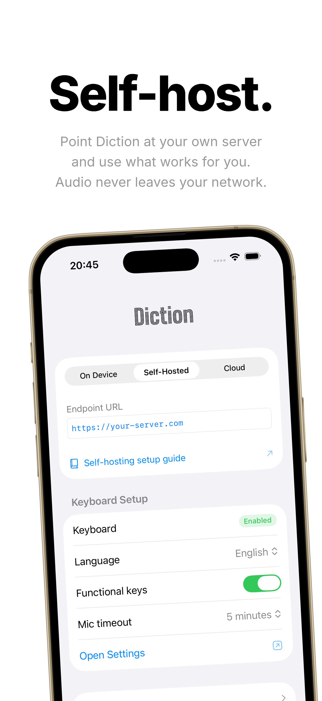

<p align="center">
  <picture>
    <source media="(prefers-color-scheme: dark)" srcset="assets/logo-light.png">
    <source media="(prefers-color-scheme: light)" srcset="assets/logo-dark.png">
    
  </picture>
  <br><br>
  <strong>Voice keyboard for iPhone.<br>You talk. We type.</strong><br>Free and open-source speech-to-text keyboard for iOS.
</p>

<p align="center">
  <a href="https://apps.apple.com/app/diction-voice-keyboard/id6759807364"></a>
</p>

<p align="center">
  <a href="https://diction.one">Website</a> &bull;
  <a href="docs/self-hosting.md">Self-Hosting Guide</a> &bull;
  <a href="docs/privacy.md">Privacy Policy</a>
</p>

<p align="center">
  <a href="https://github.com/omachala/diction/blob/master/LICENSE"></a>
  <a href="https://codecov.io/gh/omachala/diction"></a>
</p>

---

<p align="center">
  &nbsp;&nbsp;
  &nbsp;&nbsp;
  
</p>

## Why Diction?

- **Self-host in three commands** — clone, `docker compose up`, done. Runs on any machine with Docker: home server, NAS, cloud VM.
- **Any model, any server** — point Diction at your own endpoint. Fine-tuned, domain-specific, local. You choose what runs.
- **What you say stays with you** — audio goes to your server and nowhere else. No third-party routing. Full stop.
- **Free. No word limits. No catch.** — self-hosted mode is free forever. No trial, no cap, no subscription.
- **Open-source self-hosted** — server setup, gateway, and docs are all here. Inspect it, fork it, contribute.
- **99 languages** — multilingual transcription out of the box.

## How It Works

### On-Device (Free, No Setup)

Install the app, add the keyboard, and start dictating. On-device transcription works offline with no server required.

### Self-Hosted

1. Run a Whisper container on any machine (home server, NAS, cloud VM)
2. Make it reachable from your phone (local IP, reverse proxy, or [Cloudflare Tunnel](https://developers.cloudflare.com/cloudflare-one/connections/connect-networks/))
3. Paste the URL into the Diction app
4. Switch to the Diction keyboard in any app → tap mic → speak → text appears

Three commands to start the server:

```bash
git clone https://github.com/omachala/diction.git
cd diction
docker compose up -d whisper-small
```

Whisper API is now running at `http://<your-server-ip>:9002`. Done.

### Connecting the app

In the Diction app, go to the **Self-Hosted** tab and paste your server URL into the **Endpoint URL** field:

```
http://<your-server-ip>:<port>
```

Each model runs on its own port:

| Model | Port | Endpoint URL |
|-------|------|-------------|
| `whisper-tiny` | 9001 | `http://192.168.1.100:9001` |
| `whisper-small` | 9002 | `http://192.168.1.100:9002` |
| `whisper-medium` | 9003 | `http://192.168.1.100:9003` |
| `whisper-large` | 9004 | `http://192.168.1.100:9004` |
| `whisper-distil-large` | 9005 | `http://192.168.1.100:9005` |

Replace `192.168.1.100` with your server's actual IP. A green dot in the app confirms the endpoint is reachable.

## Models

Run whatever works for you. A model fine-tuned for your language. A licensed model for your industry. A private model trained on your domain. Point Diction at your server and it just works.

This repo includes a quickstart Docker Compose setup with [faster-whisper](https://github.com/fedirz/faster-whisper-server) to get you running in minutes:

```
docker compose up -d whisper-tiny          # port 9001 - ~350 MB RAM, ~1-2s
docker compose up -d whisper-small         # port 9002 - ~800 MB RAM, ~3-4s  ← recommended
docker compose up -d whisper-medium        # port 9003 - ~1.8 GB RAM, ~8-12s
docker compose up -d whisper-large         # port 9004 - ~3.5 GB RAM, ~20-30s
docker compose up -d whisper-distil-large  # port 9005 - ~2 GB RAM, ~4-6s
```

Already running your own server? Point Diction at it. The gateway handles the rest.

## No Public IP?

No problem. You don't need to open ports on your router:

- **[Cloudflare Tunnel](https://developers.cloudflare.com/cloudflare-one/connections/connect-networks/)** — free, outbound-only connection. No port forwarding needed.
- **[Tailscale](https://tailscale.com/)** — free WireGuard mesh VPN. Install on server + phone, connect from anywhere.
- **[ngrok](https://ngrok.com/)** — instant public URL, great for testing.

See the [Self-Hosting Guide](docs/self-hosting.md) for detailed instructions.

## Privacy

This is a keyboard extension. We take privacy seriously:

- **On-device**: Everything stays on your phone. No network needed.
- **Self-hosted**: Audio goes only to your server. Full stop.
- **Diction One**: Audio is processed and immediately discarded. Not stored, not used for training.
- **No analytics, no tracking, no telemetry.** The app contains zero third-party SDKs.
- **Full Access** is required by iOS for network — the keyboard needs to reach the transcription endpoint. No keylogging, no clipboard access.

Read the full [Privacy Policy](https://diction.one/privacy).

## Requirements

- **iOS 17.0+** (iPhone)
- For self-hosting: any machine that can run Docker

## Contributing

We welcome contributions to the self-hosting infrastructure, documentation, and Docker setup. See [CONTRIBUTING.md](CONTRIBUTING.md).

## License

MIT — see [LICENSE](LICENSE).

The iOS app is distributed via the App Store. This repository contains the self-hosting infrastructure and documentation.
